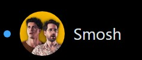

# HitTheBell
#### Video Demo:  https://youtu.be/f4OdqEt8ASU
#### Description:
### **General Goal**
This project is a web extension for Microsoft Edge. It aims to give the user notifications when a YouTube channel uploads a new video.

### **Adding Channels**
The user can search the YouTube database for channels they want to stay updated on, with an "Add" button to easily add them to the list

### **Deleting Channels**
The user can remove channels if they don't want to follow them anymore.

### **Notifications**
A blue dot will appear next to channels that have a new video since the last time the extension was opened. It can be removed by clicking on the channel name, bringing the user to the channel's page.

### **The Specifics**
Because this is a web extension, this project needed a manifest.json file, an html file, javascript files, and css files. Also, this project would not be possible without accessing the YouTube API. I had to go to the Google Cloud Console and make a project to get an API key that I could use to pull information about YouTube channels and the information about their videos.

The manifest.json file gives Edge some basic information such as what image to use as an icon (in my case, icon.png), the name of the extension, and the background.js file that allows the user to open the extension.

The popup.html file gives a framework for the popup created under the extension button when it is clicked. It uses the bootstrap framework and my custom popup.css file to style various elements of the popup. It also uses the popup.js script to load the bulk of the functionality for the popup.

### **Writing popup.js**
popup.js does many things for this project. First, this file checks whether the system is in Light or Dark mode to style the popup to match. Then, it loads the html. While loading the html, it first checks the local storage of the browser for a list of youtube channels and data about the channel such as the channel's name, icon, date of most recent video, etc. All of that information is added to the browser's storage when the user first adds a channel to the list. 

One of the challenges of this project was the "quota" the YouTube API gave me. I was limited to 10,000 queries a day, and while i was first writing and testing the extension I would surpass that quota within an hour. I quickly began to research ways to decrease my query usage, and to my surprise I found multiple ways. One way was to batch my fetch requests into little packages and use less queries to obtain the same amount of information. Another way was to store information in the browser's local storage and use it later in the code. The final way was to cache queries so I could reuse the query if it's still available. Making the program with these in mind made me rethink the entire project. 

With this in mind, I added a search bar to the extension. The search bar caches searches and uses a debounce timer to only fetch data when the user hasn't typed in 300ms. This results in a list of youtube channels and an add button to add them to the user's list. To be more specific, each channel searched temporarily has a channelId, title, playlistId to access the list of videos the channel uploaded, and the channel's icon; this data is stored in local storage as well as the date of the most recent video upload when the add button is clicked. I fetched all of this data at once to reduce the total amount of queries I would need in future parts of my code. 

If the search bar was a major function in popup.js, so was addChannelToList(). This function searches local storage for any channels added through the search bar in any previous sessions of using the extension, or it uses arguments passed from the add button to get the same information; once it gathers this information it adds it to a list tag in html to display the list of channels the user follows. This list has many parts, such as the notification icon (a small blue dot made as an svg), the channel icon, the channel title as a hyperlink to the channel's homepage, and the delete button to remove the channel from the list. With my limited experience in html and css it was tough displaying these the way I wanted to, but I managed to after hours of playing around with it.

The last major function of popup.js is checkAndDisplayNotifications(). This function runs after the list of youtubers is created and checks the local storage to find what the last recorded upload date of each channel was, then it fetches the new updated list of upload dates and compares them to what was in local storage. If any dates are newer, it unhides the notification svg, sets a flag to remember to keep the notification unhidden, and updates the upload date in local storage.
